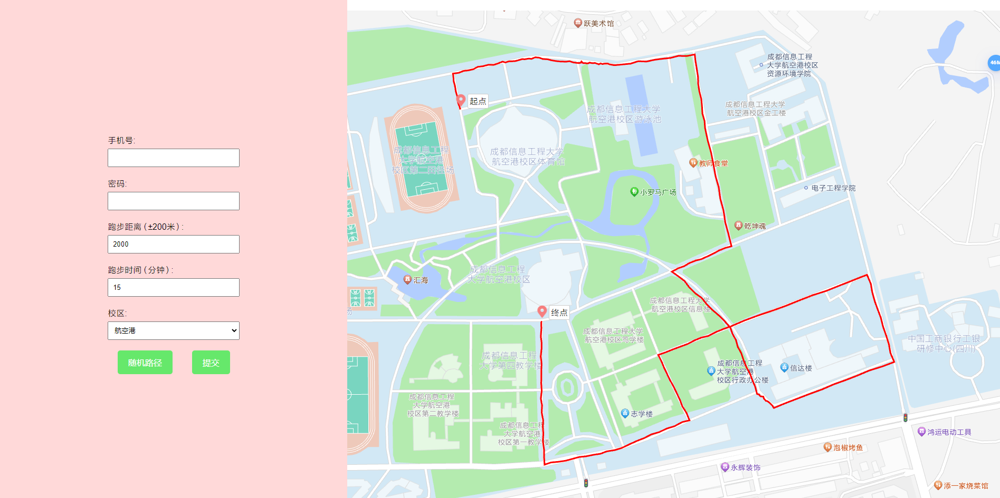

# AutoRun-Python
## 介绍
将AutoRun项目转为python项目，利用flask框架将其部署至网页端，并完善其功能

## 软件架构
基于python的flask框架开发

## 软件界面

## 安装
一，在电脑上部署Python开发环境

二，使用git或下载zip至电脑

三，在目录下打开控制台输入以下命令

`pip install -r requirements.txt`

## 启动
控制台定位至项目根目录，输入`python app.py`

默认部署至`http://localhost:9680/`